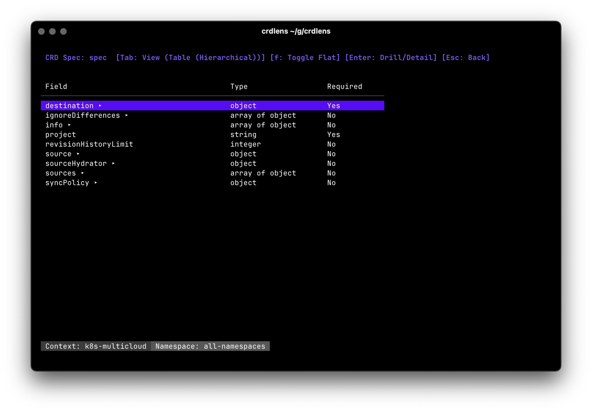
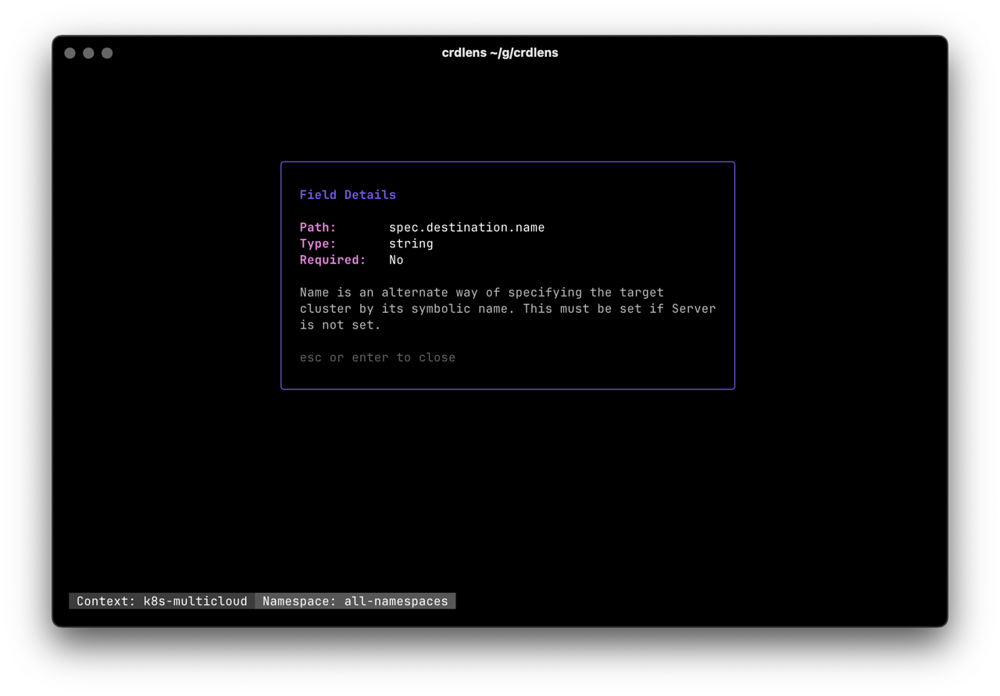
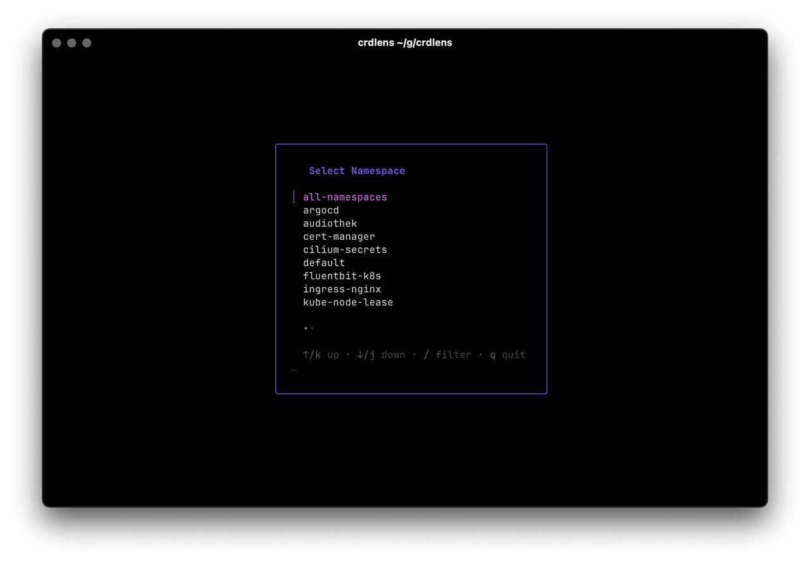

# CRDLens

CRDLens is a terminal-based explorer for Kubernetes Custom Resource Definitions (CRDs) and Custom Resources (CRs). It helps developers and operators inspect CRD schemas and manage resources efficiently from the command line with a focus on speed.

## Features

- **CRD Discovery**: List all valid CRDs in your cluster with resource counts.
- **Hierarchical Schema Explorer**: Drill down into complex CRD schemas (OpenAPI v3) with a tree-based view.
- **Resource Management**: Browse Custom Resources for any CRD with fuzzy filtering and seamless **lazy-loading** for large lists.
- **Smart UX**: Proactively suggests switching to all-namespaces mode if no resources are found in the current namespace.
- **Deep Inspection**: View resource details including YAML configuration, Events, and a structured Fields view.
- **Controller Awareness**: Monitor CR health with Ready indicators, Drift detection, and a dedicated **Reconcile Status** view showing live Lag, Silence tracking, and navigable status fields.
- **Namespace Awareness**: Easily switch between namespaces or view resources across all namespaces.

### Controller Awareness Details

CRDLens provides deep insights into the reconciliation state of your resources:

- **Status Interpretation**: Automatically determines if a resource is **Ready**, **Progressing**, **Failed**, or **Terminating**. 
  - Supports standard Kubernetes conditions.
  - Built-in support for **ArgoCD** health status (`status.health.status`).
  - Recognizes common resource **Phases** (Running, Pending, Bound, etc.).
- **Drift Detection**: Calculates the difference between `metadata.generation` and `status.observedGeneration`.
  - **Note**: If `status.observedGeneration` is missing, Drift defaults to `0` (assuming the resource is fully synced or legacy).
- **Reconcile View**: Shows "Lag" (time since last spec change vs. status update) and "Silence" (time since last status update).

## Installation

Download a pre-compiled binary for your operating system from here: https://github.com/pteich/crdlens/releases
You need just this binary. It works on OSX (Darwin), Linux and Windows.

There are also prebuilt RPM, DEB and APK packages for your Linux distribution.

### Brew

Use Brew to install either with tap:
```shell
brew tap pteich/tap
brew install crdlens
```

or directly:
```shell
brew install pteich/tap/crdlens
```

### Scoop

Use Scoop to install via bucket:
```shell
scoop bucket add pteich https://github.com/pteich/scoop-bucket.git
scoop install crdlens
```
### Go install

You need a local Go installation to use this method.

```shell
go install github.com/pteich/crdlens/cmd/crdlens@latest
```

### Docker

A Docker image is available here: https://github.com/pteich/crdlens/pkgs/container/crdlens
It can be used just like the locally installed binary: 

```shell
docker run ghcr.io/pteich/crdlens:latest -h
```

### Prerequisites
- Go 1.25 or higher
- A running Kubernetes cluster and `kubectl` configured

### Build from source
```bash
git clone https://github.com/pteich/crdlens.git
cd crdlens
go build -o crdlens ./cmd/crdlens
mv crdlens /usr/local/bin/
```

## Usage

Simply run `crdlens` in your terminal. It will use your current kubeconfig context.

```bash
crdlens
```

### CLI Flags

| Flag | Description |
| --- | --- |
| `--kubeconfig` | Path to the kubeconfig file |
| `--context` | The name of the kubeconfig context to use |
| `--namespace` | The namespace to use |
| `--all-namespaces` | List resources in all namespaces |
| `--enable-counts` | Enable CR counts in the CRD list (disabled by default) |

### Keybindings

| Key | Action |
| --- | --- |
| `Enter` | Select item / Drill down into field |
| `Esc` / `Backspace` | Go back / Navigate up hierarchy |
| `?` | Toggle Help |
| `/` | Filter / Search |
| `n` | Switch Namespace |
| `r` | Refresh list |
| `s` | Open Sort menu (in CR List) |
| `1-4` | Quick sort by Status, Name, Drift, or Age |
| `f` | Toggle Flat/Hierarchical view (in CRD Spec) |
| `↑/↓` | Switch between Conditions and Status tables (in Reconcile view) |
| `Tab` | Switch Views (YAML, Fields, Events, **Reconcile Status**) |
| `q` / `Ctrl+C` | Quit |

## Screenshots







